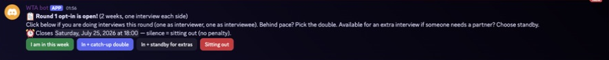
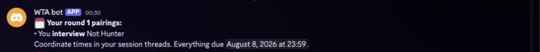
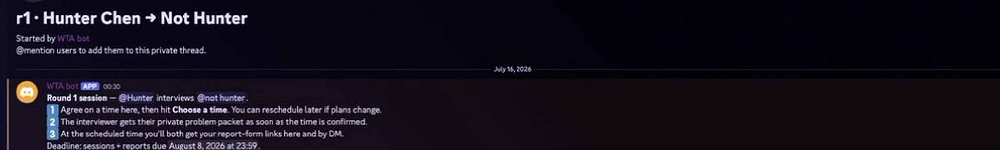
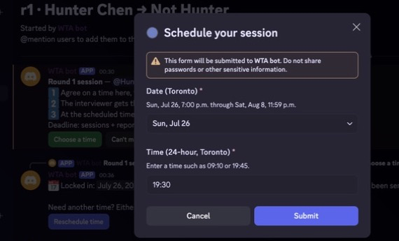
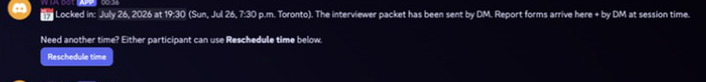
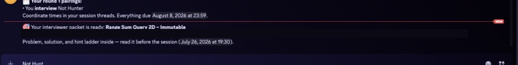
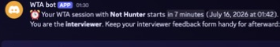

# Pairing flow walkthrough

These screenshots use a real Round 1 test session between Hunter and the `not hunter` burner account. The flow is the same for participants.

## 1. Opt in for the round

The bot posts and DMs the round opt-in before matching. **I'm in this week** requests the normal one interview in each role. **In + catch-up double** requests extra work to catch up, **In + standby for extras** makes the participant available if another person needs a partner, and **Sitting out** skips the round without a penalty. No response also means sitting out.

## 2. Pairing is released

Both participants receive a short Discord DM identifying their role and partner. The private session thread is the source of truth for scheduling.

The session thread includes the participants, their roles, the report deadline, and the actions available before the interview.

## 3. Either participant chooses a time

The **Choose a time** button opens a Discord modal. Participants select a valid date in the current round and enter a Toronto time using the 24-hour clock.

## 4. The time is confirmed

The confirmed time is posted in the private thread. Either participant can use **Reschedule time** if plans change.

## 5. The interviewer receives the problem packet

As soon as the time is confirmed, the interviewer receives the pre-assigned problem packet by DM. The interviewee does not receive the packet.

## 6. Discord sends the interview reminder

Shortly before the interview, each participant receives a role-specific DM with the session time, their role, and their feedback-form link. The private thread is updated at the same time.

## 7. Feedback forms are released

At the scheduled start time, Discord reminds both participants that their role-specific forms are ready. The dashboard also reflects which submission is still outstanding and shows the session as complete only after both reports are submitted.
